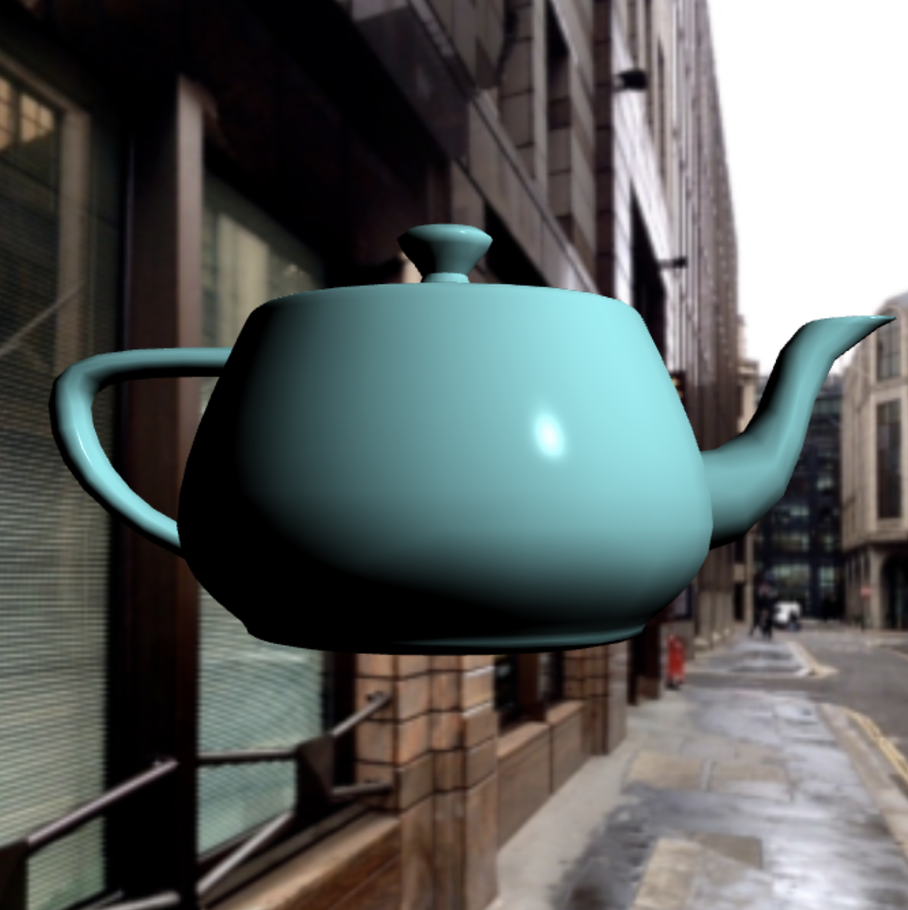
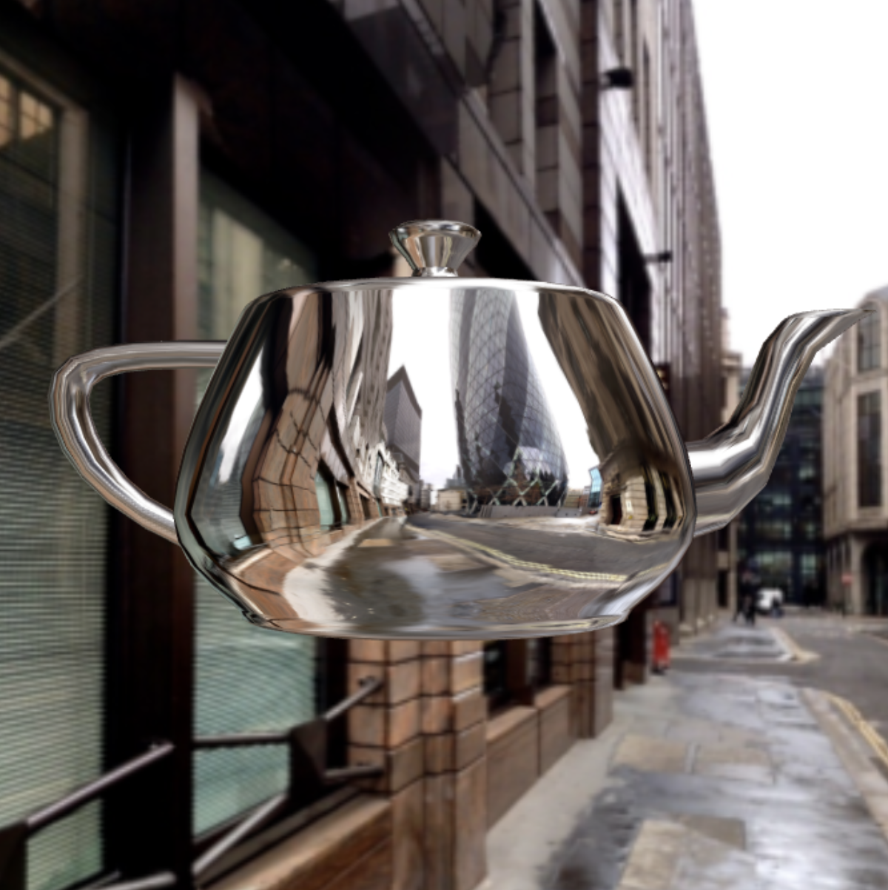
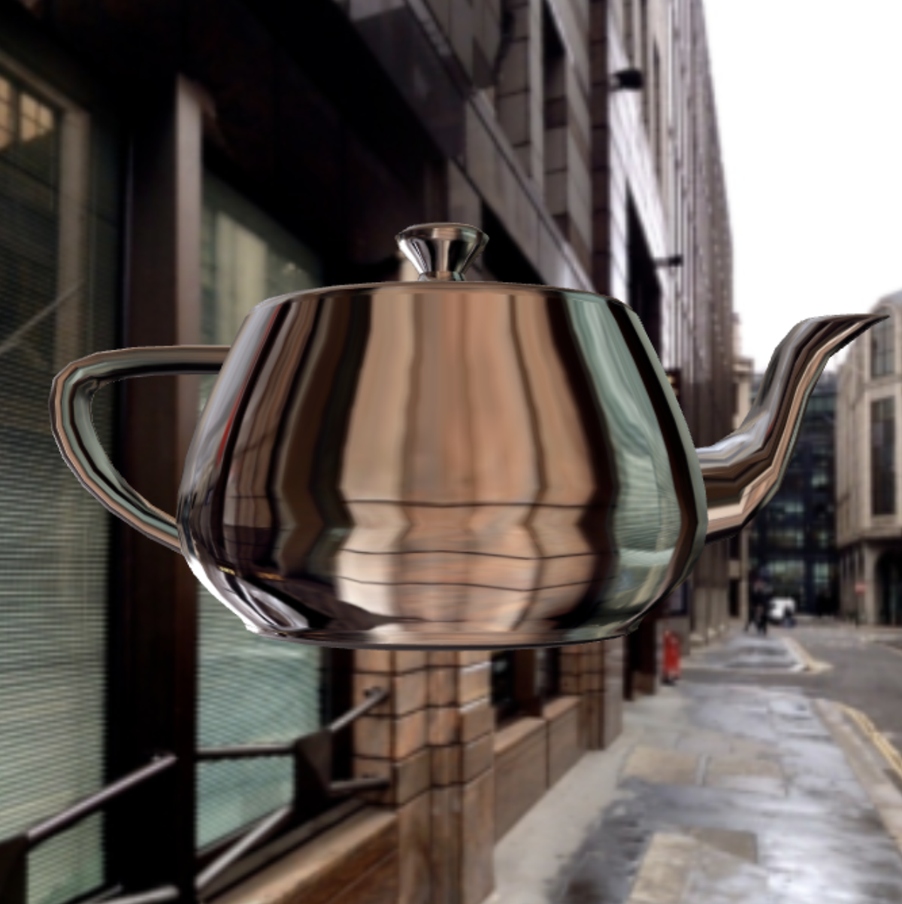

# MP3: Environment Mapping

## Results

Pressing <kbd>left</kbd>, <kbd>right</kbd>, <kbd>up</kbd>, and <kbd>down</kbd> to orbit around the teapot
Pressing <kbd>a</kbd> and <kbd>d</kbd> to rotate the teapot

Phong Shading Teapot

Reflection Teapot

Refraction Teapot

## Goal

Your goal is to write an app that loads the Utah teapot from a file and renders it.

Your app should have the following features:

* Rendered in perspective
* Skyboxing
* Allow the user view to orbit around the teapot.
* Allow the user to make the teapot rotate.
* A control in the HTML that allows the user to switch between
    1. simply shading the teapot
    2. making the teapot reflective
    3. making the teapot refractive.
* Your code should use a cubemap for the required texture effects.
    1. Reflection on the teapot should always be consistent with the scene rendered on the skybox
    2. When using the cube map on the teapot, you do not have to also use Phong relection.
